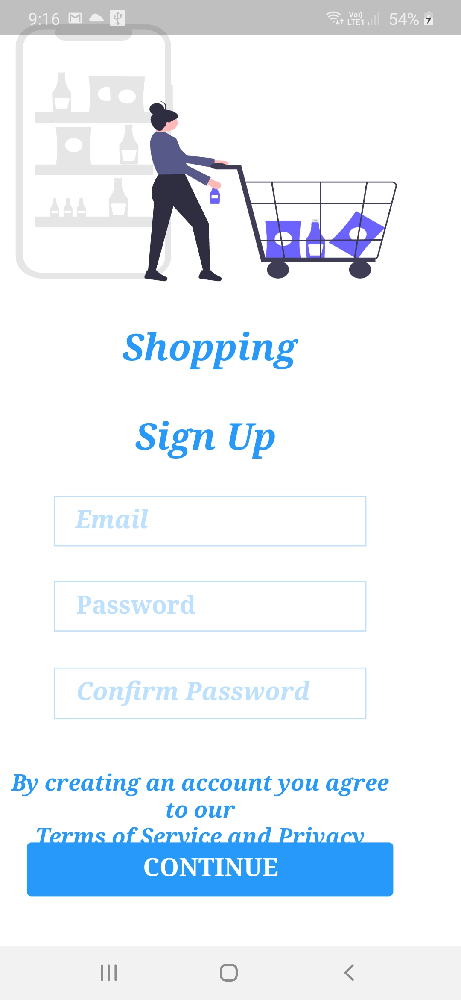

# AdobeXD Flutter Plugin  project.

 
This is first time i ever  work with Adobe XD and using this plugin is amazing experience ..

If u liked my worked please give star to repository so i would like to do more projects and contribute to communities as well 

IF you wanted latest updates

Follow me on Linkedin :
<a href="https://www.linkedin.com/in/anikit-grover/">Flutter Developer - Anikit Grover </a>

## Getting Started

This project is a starting point for a Flutter application.

A few resources to get you started if this is your first Flutter project:

- [Lab: Write your first Flutter app](https://flutter.dev/docs/get-started/codelab)
- [Cookbook: Useful Flutter samples](https://flutter.dev/docs/cookbook)

For help getting started with Flutter, view our
[online documentation](https://flutter.dev/docs), which offers tutorials,
samples, guidance on mobile development, and a full API reference.
